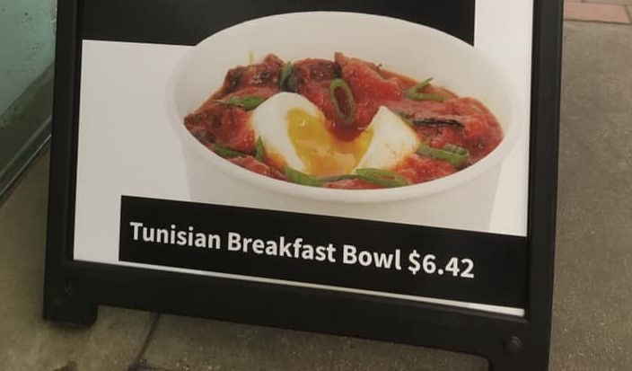

I recently walked by Clover, a fast-ish food chain in the Boston area, and noticed an ad for a “Tunisian Breakfast Bowl”: essentially the classic Mediterranean/North African dish shakshuka*. Tunisian Breakfast Bowl,* why would they rename this a classic dish? This stood out to me all the more because Clover has long done a similar renaming with one of their most popular dishes: renaming falafel to “chickpea fritter.” My first thought was that these renamings are some attempt at unnecessary pretentiousness. Clover is not just selling a “falafel,” a food that might be seen as a cheap unfancy street food, they’re selling exquisitely crafted _chickpea fritters._ I’m comfortable with things labeled as “pretentious” when that pretentiousness conveys information compactly, e.g. advanced vocabulary*.* This may actually be the case with _chickpea fritter_ as it tells you exactly what it is² without presupposing you know the term “falafel”; although, I think falafel³ is popular enough nowadays that many people know what it is. _Tunisian Breakfast Bowl,_ on the other hand, provides little info except for its possible (probable) origin⁴. Additionally, withholding the canonical names for these dishes might simultaneously be a kind of reverse pretentiousness or paternalism, an assumption that customers cannot bother or have the ability to learn a new foreign term.

Not only would using canonical names encourage customers to learn more, removing that air of pretentiousness or paternalism could also aid in improving Clover’s image. Anecdotally, Clover unfairly has a bad reputation especially with Harvard students. I think this stems mainly from a lack of interaction and thus a lack of knowledge about the high food quality. After all, when someone has access to a dining hall with free food⁵, who can blame them for avoiding purchasing food. But students do purchase food, whether it be for a late night snack or due to distance from the d-hall, and from my experience, they have some aversion to Clover. Sure, Clover’s vegetarian and somewhat healthy food may be a turnoff compared to the greasy satisfaction of Tasty Burger or [Kong](http://www.hongkongharvard.com/); those barriers are only partially surmountable with time and gradual cultural acceptance.⁶ However, a more adjustable turnoff is the somewhat pretentious or paternalistic branding and practices⁷ which, however small and reasonable, may be receiving an unreasonable amount of attention from potential customers.

While I can’t know the exact reasons for Clover’s naming choices I encourage Clover to change these dish names to _falafel_ and _shakshuka_. Or, at the very least, A/B test them: if sales are unaffected or even improve, I think many would welcome the change.

\[1\] I wanted to call this article “Clover and Pretension” but I feared people would think I was talking about heart disease by confusing hypertension and pretension😬. Also, is the word “pretension” pretentious? It’s usage seems much smaller than “pretentiousness.”

\[2\] And highlights a decently common allergen.

\[3\] Apparently not popular enough as Chrome’s spellcheck doesn’t recognize it 😢🧆🥙#inUnicodeButNotSpellcheck.

\[4\] As with many classic dishes, there are conflicting accounts of its origin but many sources point to a North African origin, see [https://en.wikipedia.org/wiki/Shakshouka](https://en.wikipedia.org/wiki/Shakshouka), [https://cooking.nytimes.com/recipes/1014721-shakshuka-with-feta](https://cooking.nytimes.com/recipes/1014721-shakshuka-with-feta), and [https://www.chowhound.com/food-news/198606/what-is-shakshuka-and-where-did-it-come-from/](https://www.chowhound.com/food-news/198606/what-is-shakshuka-and-where-did-it-come-from/).

\[5\] The vast majority of undergraduates at Harvard are on the meal plan; I’ve never met a single one who wasn’t. Harvard has extremely generous financial aid (that also covers meal plans and housing) and almost everyone lives on campus so the high rate of meal plans makes sense.

\[6\] For the record, I love vegetarianism and healthy food. I also love Clover’s food.

\[7\] Can we talk about the small sizes and limited types of coffee drinks (e.g. no lattes)? I guess that’s for another post.

\[∞\] Can’t you tell I love footnotes (and emojis … and parentheticals … and never ending a thought) 😅?
